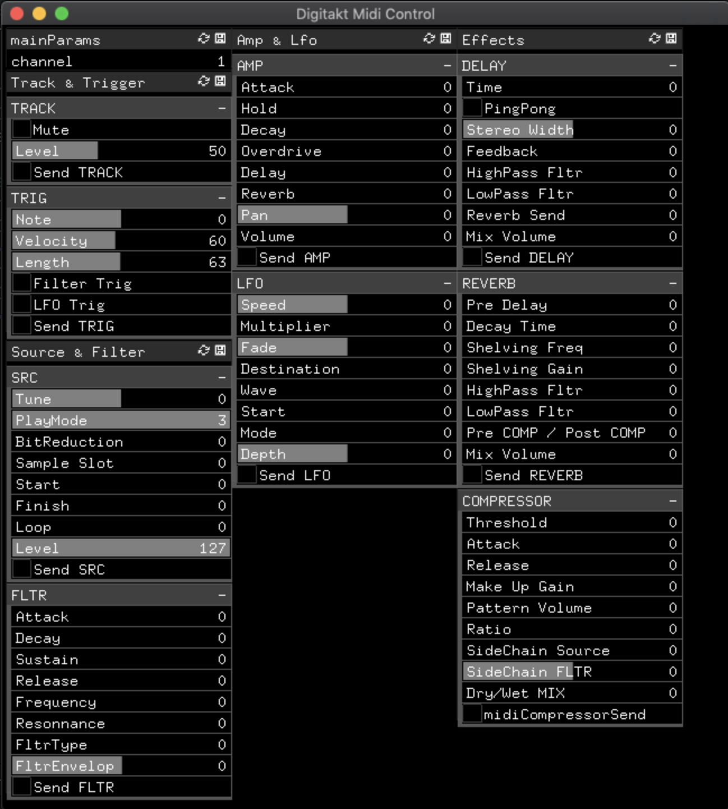

# ofxDigitaktControl

Repository to control the parameters of the [Digitakt](https://www.elektron.se/products/digitakt/) from [Openframeworks](https://openframeworks.cc/)
[.](assets/digitaktControl.gif).

This isn't a real addon, but it has the parameters pre defined for easier control.

- - - -

- - - -

### Structure
The addon works with [ofxGUI](https://github.com/openframeworks/openFrameworks/tree/master/addons/ofxGui) and [ofxMidi](https://github.com/danomatika/ofxMidi), that's the only dependency.

The structure of the control panel is simple :
* the parameters are sent when the Send buttons are triggered:
each of them sends to each different panels on the Digitakt.
*

## Getting Started
Plug the Digitakt to the computer using the USB cable which comes with it.
  
Download the addon ofxMidi, from [here](https://github.com/danomatika/ofxMidi).
Check that the addon is working before trying this.
The second addon (ofxGui), is native of Openframeworks.
 
Update the example using the project generator.
 
Try the example.

## License

This project is licensed under the MIT License - see the [LICENSE.md](./LICENSE) file for details.

## Acknowledgments

* [Elektron](https://www.elektron.se)
* [Dan Wilcox](https://github.com/danomatika/ofxMidi)

:floppy_disk:
